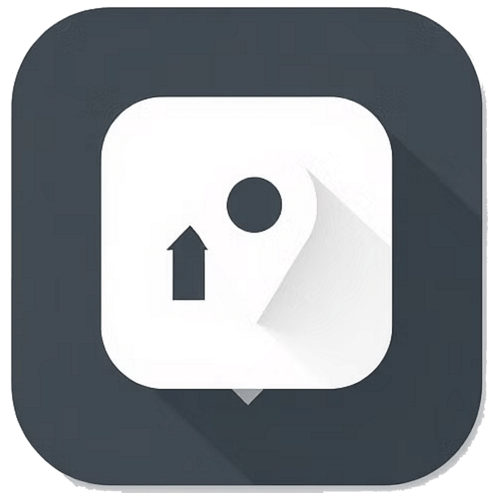

# Place Recommender

A comprehensive React Native mobile application that recommends places of interest based on user preferences, location, and behavior patterns. The app integrates with Google Maps, Google Places API, and other recommendation services to provide personalized place suggestions.



## 📱 Features

- **Personalized Place Recommendations**: Get recommendations based on your preferences, past visits, and favorite places
- **Nearby Place Notifications**: Receive notifications when you're near interesting places
- **Daily Recommendations**: Daily curated list of places you might want to visit
- **Place Search**: Search for specific places by name or category
- **Place Details**: View detailed information about places including ratings, reviews, photos, and contact information
- **Favorites**: Save places to your favorites list for quick access
- **Location-Based Features**: Discover places around your current location
- **User Authentication**: Register and login with email or Google account
- **User Profile**: Customize your profile and preferences
- **Offline Support**: Basic functionality works without internet connection

## 🛠️ Technology Stack

- **Frontend**: React Native, Expo
- **State Management**: Redux (Redux Toolkit)
- **Authentication**: Firebase Authentication
- **Database**: Firebase Firestore
- **APIs**: Google Places API, Google Maps API
- **Location Services**: Expo Location
- **Notifications**: Expo Notifications
- **Styling**: Styled Components
- **Navigation**: React Navigation
- **Language**: TypeScript

## 📋 Prerequisites

- Node.js (v14 or higher)
- npm or Yarn
- Expo CLI
- A Firebase account
- Google Maps/Places API keys

## 🚀 Getting Started

### Installation

1. Clone the repository:

```bash
git clone https://github.com/yourusername/place-recommender-reactnative.git
cd place-recommender-reactnative
```

2. Install dependencies:

```bash
npm install
# or
yarn install
```

3. Create a `.env` file in the root directory with the following environment variables:

```
EXPO_PUBLIC_FIREBASE_API_KEY=your_firebase_api_key
EXPO_PUBLIC_FIREBASE_AUTH_DOMAIN=your_firebase_auth_domain
EXPO_PUBLIC_FIREBASE_PROJECT_ID=your_firebase_project_id
EXPO_PUBLIC_FIREBASE_STORAGE_BUCKET=your_firebase_storage_bucket
EXPO_PUBLIC_FIREBASE_MESSAGING_SENDER_ID=your_firebase_messaging_sender_id
EXPO_PUBLIC_FIREBASE_APP_ID=your_firebase_app_id
EXPO_PUBLIC_FIREBASE_CLIENT_ID=your_firebase_client_id
EXPO_PUBLIC_FIREBASE_IOS_CLIENT_ID=your_firebase_ios_client_id
EXPO_PUBLIC_FIREBASE_ANDROID_CLIENT_ID=your_firebase_android_client_id
EXPO_PUBLIC_GOOGLE_PLACES_API_KEY=your_google_places_api_key
```

4. Update the `app.json` file with your Google Maps API keys for iOS and Android.

### Running the App

```bash
npx expo start
```

This will start the Expo development server. You can run the app on:

- iOS simulator (press 'i')
- Android emulator (press 'a')
- Your physical device by scanning the QR code with the Expo Go app

## 📂 Project Structure

```
place-recommender-reactnative/
├── assets/               # App assets (images, fonts)
├── src/
│   ├── components/       # Reusable UI components
│   ├── config/           # Configuration files
│   ├── context/          # React context providers
│   ├── hooks/            # Custom React hooks
│   ├── navigation/       # Navigation configuration
│   ├── screens/          # App screens
│   ├── services/         # API and service integrations
│   ├── store/            # Redux store setup and slices
│   ├── theme/            # App theming
│   └── utils/            # Utility functions
├── app.json              # Expo configuration
├── App.tsx               # App entry point
├── index.ts              # Application entry file
└── package.json          # Project dependencies
```

## 🔒 Authentication

The app provides two authentication methods:

- Email/password registration and login
- Google Sign-In

## 🗺️ Maps and Location

The app uses Google Maps for displaying locations and Google Places API for fetching place data. Location permissions are requested for:

- Foreground location tracking when using the app
- Background location for nearby place notifications (optional)

## 📱 Screens

1. **Authentication Screens**

   - Login
   - Registration
   - Forgot Password

2. **Main Screens**

   - Home (Recommendations)
   - Explore (Map View)
   - Search
   - Favorites
   - Profile

3. **Detail Screens**
   - Place Details
   - Settings
   - Notification Preferences

## 🔔 Notifications

The app sends two types of notifications:

- **Nearby Place Notifications**: When you're near a place that matches your preferences
- **Daily Recommendations**: Daily notification with personalized place suggestions

## 🛣️ Recommendation Algorithm

Places are recommended based on:

- User's favorite place types
- Previous ratings
- Price preferences
- Location proximity
- Place popularity

## 📊 Data Storage

User data and preferences are stored in Firebase Firestore.

## 🛠️ Development

### Adding New Features

1. Create new components in the `src/components` directory
2. Add new screens in the `src/screens` directory
3. Update navigation in `src/navigation`
4. Add Redux slices in `src/store/slices` as needed

### Environment Variables

The app uses environment variables for API keys and configuration. Make sure to set up the `.env` file properly.

## 📄 License

This project is licensed under the MIT License - see the LICENSE file for details.

## 🤝 Contributing

Contributions are welcome! Please feel free to submit a Pull Request.
